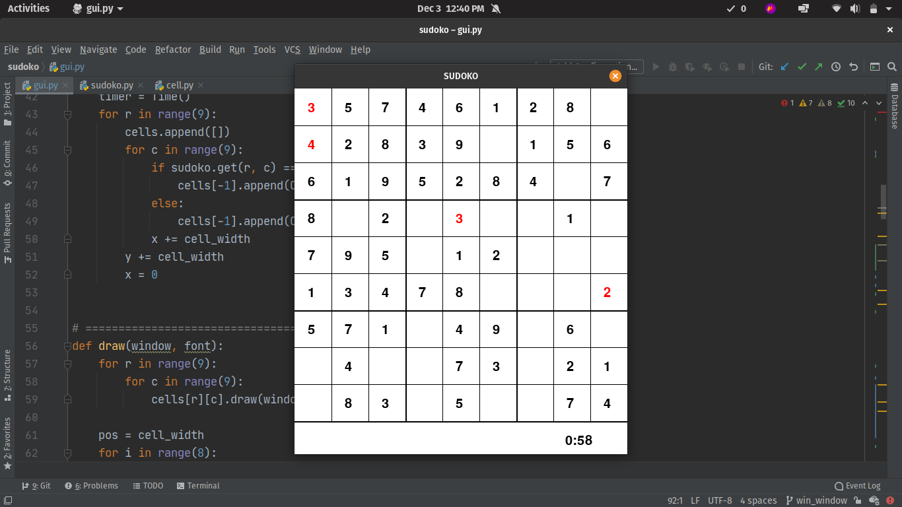
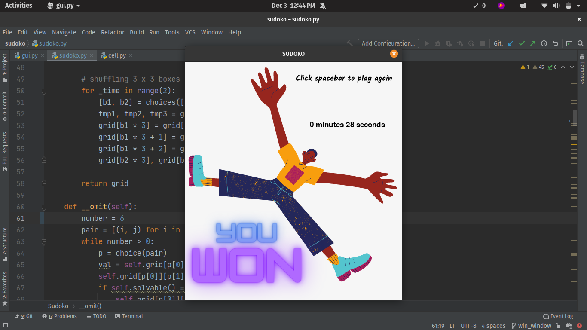
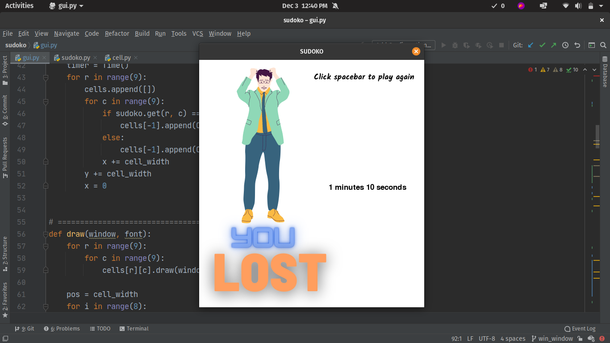

<h1 style="text-align: center;"> SUDOKO </h1>

### Running

> 1. Clone
>
> ```bash
> gh repo clone TheMartian73/sudoko
> ```
> or
>
> ```bash
> git clone https://github.com/TheMartian73/sudoko.git
> ```
>
> 2. Run
>```bash
> python3 main.py
>```





